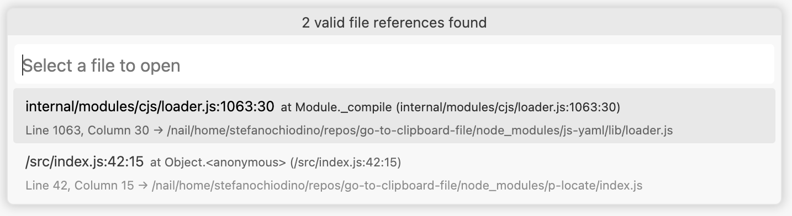

# Go to Clipboard File

VS Code extension that parses file:line references from your clipboard and opens them directly in the editor. Perfect for jumping to specific locations from stacktraces, error logs, test outputs, and any text containing file paths with line numbers.

For example, if your clipboard contains:

```text
Error: Something went wrong
    at Object.<anonymous> (/src/index.js:42:15)
    at Module._compile (internal/modules/cjs/loader.js:1063:30)
```

Then in this repository it will show:



## What it does

1. **Reads your clipboard** for file:line references
2. **Parses multiple formats** including Python stacktraces, JavaScript stack traces, and generic file:line patterns
3. **Resolves file paths** intelligently - checks absolute paths first, then workspace-relative paths
4. **Opens files directly** at the specified line and column (when available)
5. **Shows selection dialog** when multiple references are found
6. **Falls back to Quick Open** when no file references are detected

## Supported formats

- **Python stacktraces**: `File "/path/to/file.py", line 42`
- **JavaScript/Node stacktraces**: `at function (/path/to/file.js:123:45)`
- **Generic file:line patterns**: `file.txt:123`, `src/app.py:45:12`, `./relative/path.js:10`
- **Absolute and relative paths**: Works with both `/absolute/paths` and `relative/paths`

## Keyboard Shortcut

- **Windows/Linux**: `Ctrl+Shift+G`
- **Mac**: `Cmd+Shift+G`

## Local Installation

### Prerequisites

- Node.js (v16 or higher)
- npm
- VS Code

### Build from Source

1. Clone the repository:
```bash
git clone https://github.com/yourusername/go-to-clipboard-file.git
cd go-to-clipboard-file
```

2. Install dependencies:
```bash
npm install
```

3. Compile the extension:
```bash
npm run compile
```

4. Package the extension:
```bash
npm run package
```

This creates a `.vsix` file in the project directory.

### Install the Extension

#### Option 1: Install via Command Line

```bash
code --install-extension go-to-clipboard-file-0.0.1.vsix
```

#### Option 2: Install via VS Code UI
1. Open VS Code
2. Go to Extensions view (`Ctrl+Shift+X`)
3. Click the `...` menu at the top of the Extensions view
4. Select "Install from VSIX..."
5. Browse to and select the `.vsix` file

### Development

To run the extension in development mode:

1. Open the project in VS Code
2. Press `F5` to launch a new Extension Development Host window
3. The extension will be available in the new window

To watch for changes during development:
```bash
npm run watch
```

## Usage

1. **Copy text with file references** - Copy any text containing file paths with line numbers (stacktraces, error logs, etc.)
2. **Use the keyboard shortcut** - Press `Ctrl+Shift+G` (Windows/Linux) or `Cmd+Shift+G` (Mac)
3. **Select file if needed** - If multiple valid files are found, pick from the dialog (most recent entries shown first)
4. **Navigate instantly** - VS Code opens the file and jumps to the exact line and column

**Pro tips:**
- Works with any text format containing `filename:line` or `filename:line:column` patterns
- Automatically filters out non-existent files from selection
- Falls back to Quick Open (`Ctrl+P`) if no file references are detected
- Configure `stripPrefixes` to handle Docker/container paths that don't match your local filesystem

## Example Stacktraces

The extension can parse stacktraces like:

**Python:**
```
Traceback (most recent call last):
  File "/path/to/file.py", line 287, in run
    return self.execute()
  File "/another/file.py", line 61, in execute
    return action(**match)
```

**JavaScript/Node:**
```
Error: Something went wrong
    at Object.<anonymous> (/src/index.js:42:15)
    at Module._compile (internal/modules/cjs/loader.js:1063:30)
```

**Generic:**
```
Error in src/components/Button.tsx:45
Failed at utils/helper.js:123:8
```

## Try it out

Test the extension immediately with these examples from this repository. **Copy any line below**, then press `Ctrl+Shift+G` (or `Cmd+Shift+G` on Mac):

```
src/extension.ts:15
src/parser.ts:42
package.json:5
tsconfig.json:8
README.md:25
src/test/suite/extension.test.ts:10
```

Or copy this mock Python stacktrace:
```
Traceback (most recent call last):
  File "src/extension.ts", line 25, in activate
    registerCommand()
  File "src/parser.ts", line 68, in parseClipboard
    return extractFiles()
```

Or this JavaScript error format:
```
Error occurred:
    at activate (src/extension.ts:31:12)
    at parseFileReferences (src/parser.ts:89:5)
    at Object.<anonymous> (package.json:1:1)
```

The extension will parse these and let you jump directly to the files in this repository!

## Configuration

You can configure the extension by adding settings to your VS Code settings:

```json
{
  "go-to-clipboard-file.stripPrefixes": [
    "/app/",
    "/workspace/",
    "/usr/src/app/",
    "C:\\container\\"
  ]
}
```

### Settings

- `go-to-clipboard-file.stripPrefixes`: Array of path prefixes to strip from file paths. Useful for handling container paths that VS Code wouldn't otherwise recognize.

## How file resolution works

The extension intelligently resolves file paths in this order:

1. **Absolute paths**: If the path starts with `/` or `C:\`, checks if the file exists directly
2. **Strip configured prefixes**: Removes prefixes like `/app/`, `/workspace/` (see Configuration)
3. **Workspace relative**: Tries the path relative to each workspace folder
4. **Pre-validation**: Only shows files that actually exist on disk in selection dialogs

**Key behaviors:**
- Skips non-existent files from selection dialogs
- If only one valid file remains after filtering, opens it directly
- Preserves line and column information for precise navigation
- Shows most recent stacktrace entries first in selection dialog

## Testing

Run the test suite:
```bash
npm test
```

## License

MIT